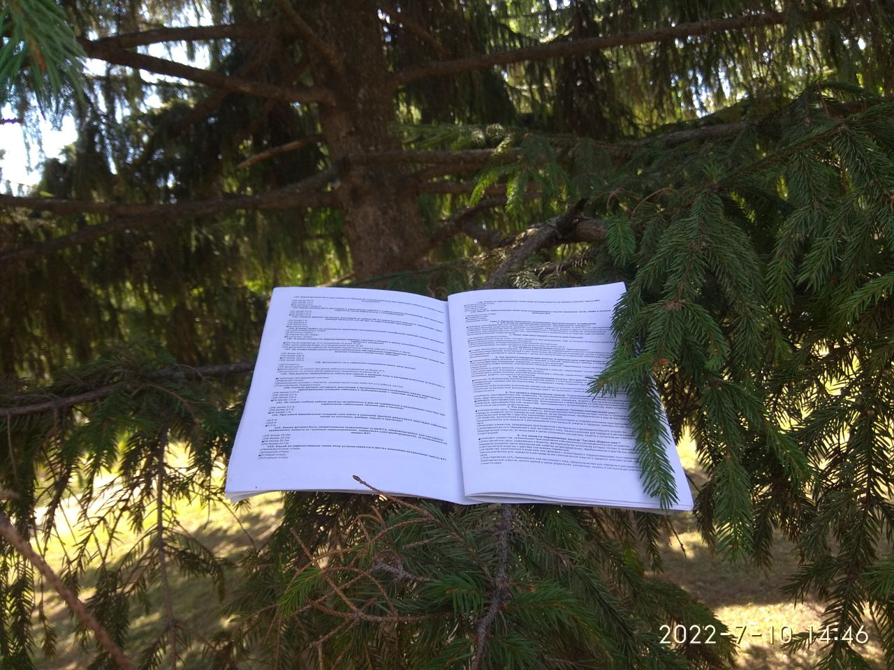

# Limpx/Олимпокс: распечатка вопросов к экзаменам Роспотребнадзора

Для сдачи экзаменов по электробезопасности курсантам предлагается
[online-система](https://pandia.ru/text/81/301/22443.php). В системе 2
режима - подготовительная сдача и просмотр правильных ответов. 

Для удобства заучивания материал оформлен с учётом следующего:

- правильный ответ помечен среди неправильных;
- возможность распечатки.

## Стадии работы с данными (data flow)

Хранилище файловое, каталоги создаются в /tmp, можете поменять в
исходнике себе это значение на нужное.

- download - паук обходит все курсы, качая по одной странице. логин и
  пароль берутся из переменных окружения соответственно `LIMPX_USERNAME`
  и `LIMPX_PASSWORD`. Страница, в которую их вводить -
  `LIMPX_SCHEME_HOST_PORT`. Номер группы курсов 140020276 тоже в
  исходнике поменять, наверное, нужно будет - даже фронтендер
  разберётся, на какой именно)

- attend - сборка страниц по темам.

- collate - сборка страниц по курсам (у кого какой экзамен).

- печать - по 5 вопросов на страницу a4 - при желании можно
  предварительно слить все свои HTML в один файл, а после - распечатать
  его в виде брошюры A5
  ([пример](https://limpx-dump.vereshagin.org/courses-pdf/eb-1254.2_-_podgotovka-i-proverka-znanij-rukovoditelej-specialistov-elektrotexnicheskogo-i-elektrotexnologicheskogo-personala-organizacij-osuwestvlyayuwix-ekspluataciyu-elektroustanovok-potrebitelej-ii-gruppa-po-elektrobezopasnosti-do-1000-v/Tema-1-Pravila-ustrojstva-e-lektroustanovok.pdf)).

Где-то после скачивания прогоняется перекодировщик из windows-1251 в
utf-8. Кажется, он меняет файлы безвозвратно, так что сделать резервную
копию перед этим бывает не лишне.

## Как запускать

Поставьте Perl. Если у вас windows - берите от
[Cygwin](https://cygwin.com), но можно и другой. Версию можно и не
новую, 5.12 должно быть достаточно.

Поставьте тогда потом все зависимости - `LWP::UserAgent`,
[tidy](http://tidy.sf.net) и т. д.

Запускать, кажется, в таком порядке:

- `limpx`
- `limpx_recode`
- `limpx_attend`
- `limpx_collate` 
- `limpx-collate-topic`

## Бизнес-модель

Вполне возможно, вам будут рады с этим во вконтакте. Я бы, может, и рад
побарыжить, да пароли протухли. Заново не скачаешь, а билеты уж все
другие.

## Final Outcome

and its stages are introduced on <https://limpx-dump.vereshagin.org>:

- [downloaded](https://limpx-dump.vereshagin.org/courses-downloaded/)
  HTML files as they are;
- [topics](https://limpx-dump.vereshagin.org/courses-collate/) HTML
  joined quizzes
- [courses](https://limpx-dump.vereshagin.org/courses-attend/)
  attendee-oriented joint HTML single file, ready to print;
- [printables](https://limpx-dump.vereshagin.org/courses-pdf/eb-1254.2_-_podgotovka-i-proverka-znanij-rukovoditelej-specialistov-elektrotexnicheskogo-i-elektrotexnologicheskogo-personala-organizacij-osuwestvlyayuwix-ekspluataciyu-elektroustanovok-potrebitelej-ii-gruppa-po-elektrobezopasnosti-do-1000-v/)
  example of a single role's PDF materials to study.

## Баги

Были выявлены в олимпоксе. О, немало. Ну и кто их там будет фиксить.
Помогли ли они мне сдать на вторую группу электробезопасности до 1000 В?
Оценка "отлично".

## Author, license

Peter Vereshagin <peter@vereshagin.org>, 3-clause BSD
